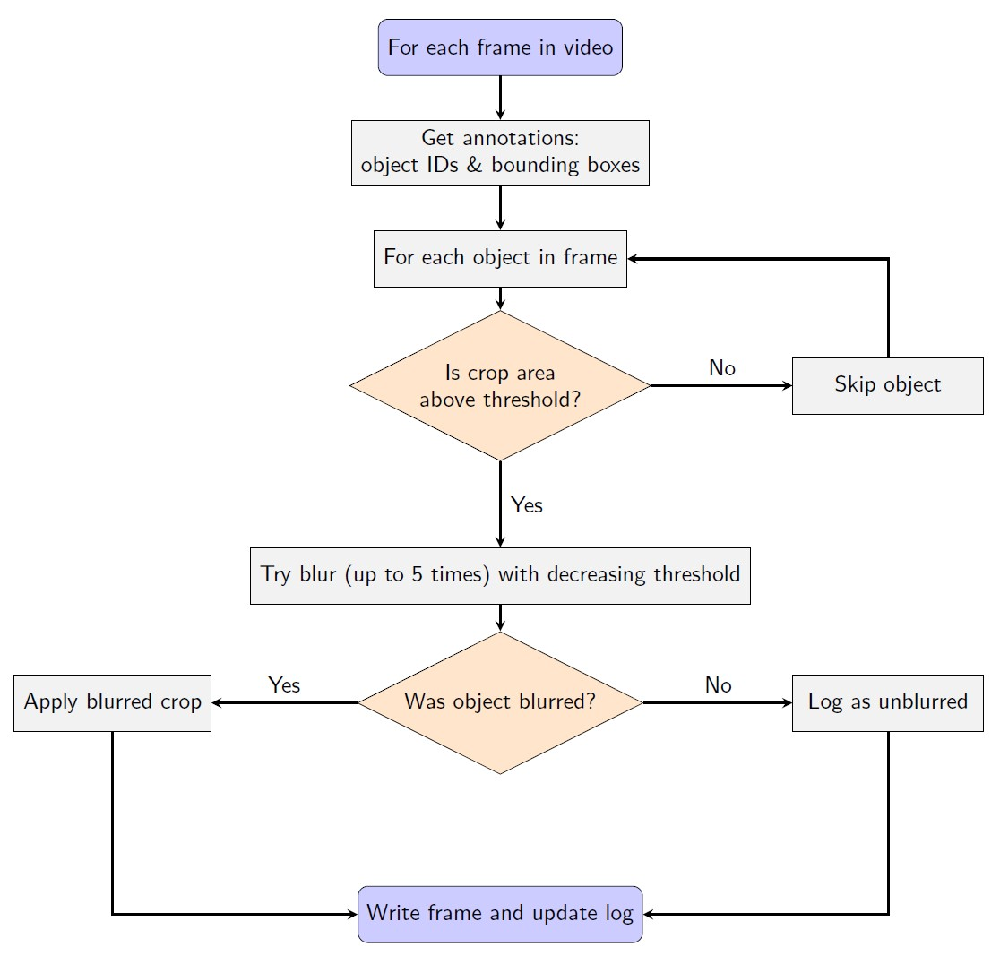

# README.md

# 🎥 Video Anonymization with EgoBlur

This repository provides a pipeline to anonymize video datasets by blurring sensitive content (e.g., license plates, faces) using the **EgoBlur** model.

## 🔎 What is This?
With increasing privacy concerns and legal restrictions on visual data, it's essential to anonymize personally identifiable information in videos. This project uses **EgoBlur**, a vision model for responsible anonymization, to automatically detect and blur such information in a scalable and smart way.

## 🤯 Key Features
- License plate detection and elliptical Gaussian blurring
- Object ID tracking across frames using annotations
- Adaptive multi-pass thresholding for robust detection
- Dynamic cropping thresholds to skip tiny irrelevant regions

## 📅 EgoBlur: Responsible Innovation in Aria
Cited from:
> Raina et al., "EgoBlur: Responsible Innovation in Aria", arXiv:2308.13093 ([link](https://arxiv.org/abs/2308.13093))

## 🚀 Installation
```bash
git clone https://github.com/your-username/egoblur-anonymization
cd egoblur-anonymization
conda create -n ego_blur python=3.9
conda activate ego_blur
pip install -r requirements.txt
```

Make sure to place the model checkpoint `ego_blur_lp.jit` under `models/`.

## 🌐 Directory Structure
```
.
├── src/
│   ├── main_pipeline_with_cropping.py
│   ├── ego_blur_utils.py
│   └── ego_blur_utils_eliptical.py
├── frames/
│   └── video_220047/   # extracted frames
├── models/
│   └── ego_blur_lp.jit
├── output_annotation_crop_fast/
├── annotations/
│   └── tracking_annotations/gmot/video_220047.txt
```

## ⚖️ Pipeline Overview



## 🔢 How It Works
1. **For each frame in the video**:
   - Get all bounding boxes and object IDs from the annotation file
   - Crop the bounding box region
   - If area is too small, skip
   - Try to blur it using EgoBlur (up to 5 attempts with decreasing threshold)
   - Replace in frame if blurred, otherwise log
2. Save updated frame
3. Export log as JSON summarizing blur status of each object across frames

## 💡 Tips
- You can tune `min_crop_area_ratio` and `nms_iou_threshold` for different datasets
- Blurring logic is separated in `ego_blur_utils_eliptical.py` and can be modified for different blur effects

## 🎥 Sample Results
> Before vs After blurring visualizations and sample video outputs

Demo


## 🔗 Citation
```bibtex
@misc{raina2023egoblurresponsibleinnovationaria,
      title={EgoBlur: Responsible Innovation in Aria}, 
      author={Nikhil Raina and Guruprasad Somasundaram and Kang Zheng and Sagar Miglani and Steve Saarinen and Jeff Meissner and Mark Schwesinger and Luis Pesqueira and Ishita Prasad and Edward Miller and Prince Gupta and Mingfei Yan and Richard Newcombe and Carl Ren and Omkar M Parkhi},
      year={2023},
      eprint={2308.13093},
      archivePrefix={arXiv},
      primaryClass={cs.CV},
      url={https://arxiv.org/abs/2308.13093}, 
}
```

---

Developed with ❤️ for responsible AI research.
